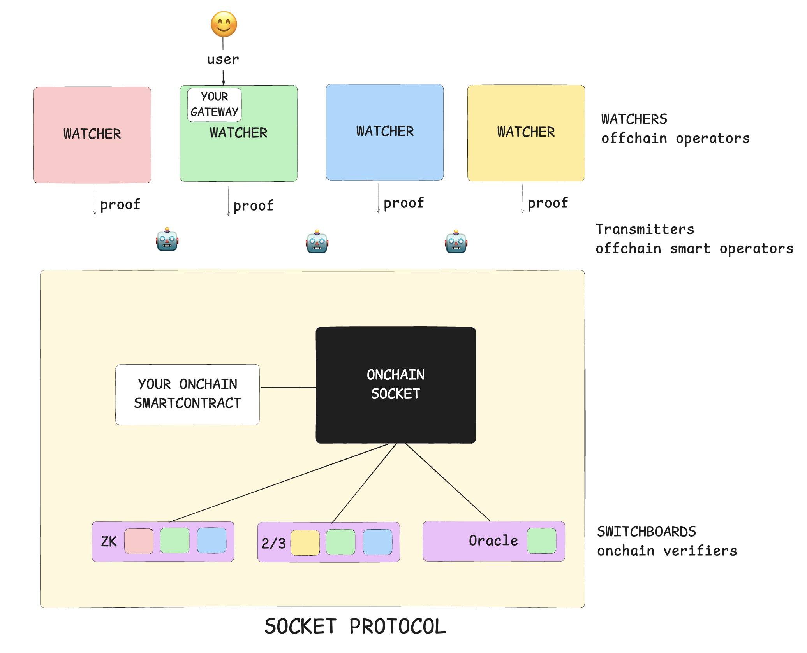

# Architecture

Status: Not started

SOCKET is a protocol and not a chain, using a combination of offchain agents(watchers, transmitters) and onchain contracts(switchboards) it enables application-builders to build truly chain-abstracted protocols. Developers can now write application-gateway contracts that can function as composers, auctions or anything else you can think about for the onchain contracts.

SOCKET protocol has a few components:

- **Watchers**: Offchain operators that run specialised VMs with various functionalities and act as hosts for app-gateways while they watch chains. They will emit a proof that can be verified onchain via app-defined switchboards. Anyone can become a watcher, this is a passive role aka just run a node and sit back. Read more about Watchers [here](/watchers)
- **Transmitters**: Offchain smart operators, that assemble the watcher-generated-proof and perform onchain actions to satisfy what the user wanted to get done onchain, so if you want to execute an onchain interaction, transmitters can get it done for you efficiently by coordinating with your gateway. Read more about transmitters [here](https://www.notion.so/Transmitters-150818fd285880a49c6bdfd843b567b1?pvs=21)
- **Switchboards**: These are onchain smart contracts that developers can use to validate the execution of app-gateway that is happening offchain, anyone can build a verifier and use it for their application. Switchboards essentially contain conditional logic on when to consider watcher proof valid, modularity here helps developers make their application as secure, cheap or fast as they desire depending on their application needs. Read more about switchboards here

And you as a developer get to dictate not just your onchain logic but also offchain logic to help compose your smart-contracts together:

- **App-Gateway**: You can write custom functionality in these contracts, logic that helps you compose your onchain contracts better, or execution of some pre-execution logic before things get executed onchain like safety checks, auctions or anything you can imagine.
- **On-Chain App Contracts**: These are smart contracts that get deployed and executed onchain, like how you are used to so far.

Using the diagram above as visual aid, let us walkthrough the protocol:

- User signs and offchain message and sends it to a watcher where your app-gateway is deployed
- Your app-gateway executes and the watcher generates a proof, which the transmitter then takes onchain
- Transmitter submits the signed user-message as well as the watcher proofs and sends it to the onchain SOCKET which then sends the proofs to switchboard selected by the application-dev
- Switchboard replies back with a boolean post which your onchain smart contract is triggered by onchain SOCKET

NOTES:

- add multichain context
- add tx-flow
- link to usecases
