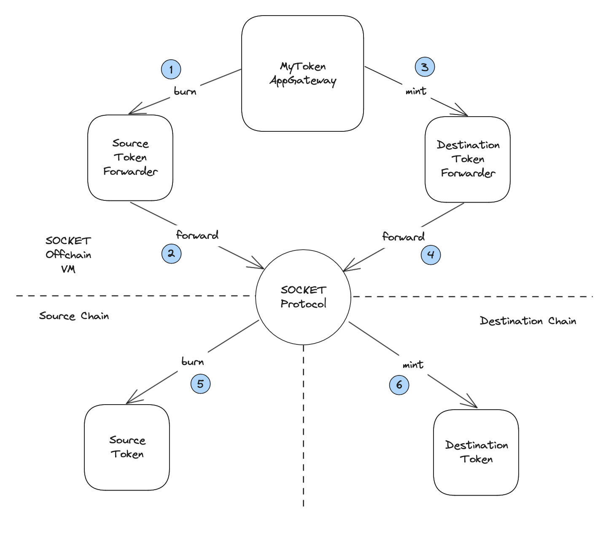

# How to call onchain contracts?

## 1. Contract call example

Calling onchain contracts from Socket’s offchain vm is very similar to how you call another contract on single chain. Let us compare both these to understand it.

Following is an example of how `HelloNoter` calls the `receiveNote` function of `Note` when both of them are on single chain. You simply create an instance of `Note` and call `receiveNote` function on it.

```solidity
contract Note {
    string pulic note;

    modifier onlyHelloNoter() {
        require(msg.sender == helloNoter, "not hello noter");
        _;
    }

    function receiveNote(string calldata newNote) external onlyHelloNoter {
        note = newNote;
    }
}

contract HelloNoter {
    function writeHelloNote() external {
        Note note = Note(noteAddress);
        // Call the receiveNote function of Note contract
        note.receiveNote("Hello");
    }
}
```

Similarly this is how you call a contract that is on chain from Socket’s offchain vm.

```solidity
// this contract is on chain
contract Note {
        string pulic note;
        modifier onlySOCKET() {
        require(msg.sender == socket, "not socket");
        _;
    }

    function receiveNote(string calldata newNote) external onlySOCKET {
        note = newNote;
    }
}

// this contract is on offchain vm
contract HelloNoter is AppGatewayBase {
    function writeHelloNote() external async {
        Note note = Note(noteForwarderAddress);
        // Call the receiveNote function of Note contract
        note.receiveNote("Hello");
    }
}
```

This looks very similar to the first example, you create a contract instance and call `receiveNote` on it. But there are some key differences to notice -

- `Note` contract uses `onlySOCKET` modifier instead of `onlyHelloNoter` for `receiveNote` function.
- `HelloNoter` contract extends `AppGatewayBase`.
- `writeHelloNote` function has an `async` modifier.
- Also, notice that the contract instance is created using `noteForwarderAddress` instead of `noteAddress`.

## 2. Call Forwarders

Let us look at how this is executed to better understand what is going on.


SOCKET works with special `forwarder` contracts that are deployed automatically when you [deploy](/deploy) your on chain contracts. Each forwarder contract is immutable and points to a specific `(chain,address)`. This is how it knows which chain and which address to forward calls to when it is called. The `AppGatewayBase` contract has utilities like `async` modifier to make it easier to work with SOCKET primitives. The final call to `Note` contract is done by SOCKET and therefore it needs `onlySOCKET` modifier.

## 3. Batch calling

The `async` modifier works on a queue of transactions, and therefore you can make a batch of onchain calls in single function and they are delivered to chains in order.

To understand this let us go back to `MyTokenAppGateway` example from our [guide](/writing-apps).

```solidity
contract MyToken is ERC20 {
    modifier onlySOCKET() {
        require(msg.sender == socket, "not socket");
        _;
    }

    function mint(address to_, uint256 amount_) external onlySOCKET {
        _mint(to_, amount_);
    }

    function burn(address from_, uint256 amount_) external onlySOCKET {
        _burn(from_, amount_);
    }
}
```

Lets extend the `MyTokenAppGateway` to add a `transfer` function that burns tokens on source chain followed by minting them on destination chain.



```solidity
contract MyTokenAppGateway is AppGatewayBase {
        ...

    function transfer(
        uint256 amount,
        address srcForwarder,
        address dstForwarder
    ) external async {
        MyToken(srcForwarder).burn(msg.sender, amount);
        MyToken(dstForwarder).mint(msg.sender, amount);
    }
}
```

This simple function enables burning of tokens on source chain and minting them on destination after burn is done.

## 4. Reading the return data

Reading the return data of a contract call is similar to how you [read on chain state](/read). With the difference being that `isReadCall` flag is set to false. Which is also its default state.

Lets extend the `MyToken` example by adding a `burnAll` function that burns all user tokens and returns the amount.

```solidity
contract MyToken is ERC20 {
    ...

        function burnAll(address from_) external onlySOCKET returns(uint256) {
                uint256 amount = balanceOf[from_];
                _burn(from_, amount);
                return amount;
        }
}
```

Lets add a `transferAll` function to `MyTokenAppGateway` that uses this amount to mint on destination.

TODO: Add flow diagram

```solidity
contract MyTokenAppGateway is AppGatewayBase {
        ...

        function transferAll(
                address srcForwarder,
                address dstForwarder
        ) external async {
                isReadCall = false;
                MyToken(srcForwarder).burnAll(msg.sender);
                address asyncPromise = IPromise(srcForwarder).then(
            this.transferAllCallback.selector,
            abi.encode(msg.sender, dstForwarder) // passed to callback
        );
        isValidPromise[asyncPromise] = true;
        }

        function transferAllCallback(
                bytes calldata data,
                bytes calldata returnData
        ) external onlyPromises async {
            (address user, address dstForwarder) = abi.decode(
                data,
                (address, address)
            );
            uint256 amount = abi.decode(returnData, (uint256));
            MyToken(dstForwarder).mint(user, amount);
        }
}
```

We use the promise and callback pattern, similar to how reads are done.

`transferAllCallback` is set as callback for the `burnAll` function call. We pass the `user` address and `dstForwarder` address as part of `data` to the callback and get the `amount` in `returnData`.

Interestingly, the `transferAllCallback` function also has `async` modifier and the `mint` function is called from this callback. Such nesting of `callbacks` and `async` calls can be done to implement more complex logic that involves interacting with multiple chains at different steps.
