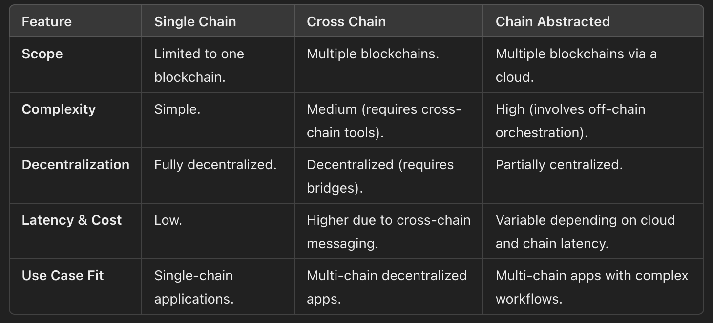

# Types of Composability

Status: Not started

# Introduction

The ability of applications and protocols to interact and build upon each other seamlessly is at the core of blockchain applications. Composition started with the context of single chain where contracts could interact with each other atomically and synchronously. With multiple chains coming onto the scene, cross-chain composability emerged. unlike single chain this is asynchronous and non-atomic.

The huge surge and ease of deploying new chains recently has come with its own bottlenecks. Based on the number of contracts and use cases that actually compose across chains, it is clear that cross chain composability cannot scale and cannot deliver the developer experience needed to unlock imagination.

There is a need for asynchronous atomic composability that can scale to immense number of chains.



# Stage 1: Single Chain Composability

In the early days of blockchain, composability was simple and effective. All smart contracts and dApps operated within a single blockchain ecosystem. Interactions were direct, leveraging the shared state and environment of the chain. Developers could easily build complex, interdependent applications without worrying about interoperability or external messaging overhead.

```solidity
contract FirstNote {
    string public note;
    function setNote(string memory newNote) onlyOrderedNoter {
        note = newNote;
    }
}

contract SecondNote {
		string public note;
    function setNote(string memory newNote) onlyOrderedNoter {
        note = newNote;
    }
}

contract OrderedNoter {
    address firstNote;
    address secondNote;

    function writeNotes(string memory noteA, string memory noteB) {
        INote(firstNote).setNote(noteA);
        INote(secondNote).setNote(noteB);
    }
}
```

# Stage 2: Cross Chain Composability

Cross-chain composability emerged to address the multi-chain landscape. Protocols and tools were developed to enable contracts on one chain to interact with those on another. Using cross-chain messaging protocols and bridges, developers could extend the functionality of their applications across multiple blockchains.

```solidity
contract FirstNote {
    string public note;
    uint256 orderedNoterChain;
		address orderedNoterAddress;

    function inbound(
        uint256 callerChain,
        address callerAddress,
        bytes memory payload
    ) onlyCrossChain {
        string memory newNote = abi.decode(payload, (string));
        note = newNote;
        crossChain.outbound(orderedNoterChain, orderedNoterAddress, bytes(""));
    }
}

contract SecondNote {
    string public note;
    uint256 orderedNoterChain;
		address orderedNoterAddress;

    function inbound(
        uint256 callerChain,
        address callerAddress,
        bytes memory payload
    ) onlyCrossChain {
        string memory newNote = abi.decode(payload, (string));
        note = newNote;
        crossChain.outbound(orderedNoterChain, orderedNoterAddress, bytes(""));
    }
}

contract OrderedNoter {
		uint256 firstNoteChain;
		address firstNoteAddress;
		uint256 secondNoteChain;
		address secondNoteAddress;
		string storedNoteB;

    function writeNotes(string memory noteA, string memory noteB) {
        bytes memory payloadA = abi.encode(noteA);
        storedNoteB = noteB;
        crossChain.outbound(firstNoteChain, firstNoteAddress, payloadA);
    }

    function inbound(
        uint256 callerChain,
        address callerAddress,
        bytes memory payload
    ) onlyCrossChain {
        if (callerChain == firstNoteChain) {
            bytes memory payloadB = abi.encode(storedNoteB);
			      crossChain.outbound(secondNoteChain, secondNoteAddress, payloadB);
        }
    }
}
```

# Stage 3: Chain Abstracted Composability

As the number of chains continues to grow, the focus shifts from **connecting chains** to **abstracting them altogether**. Just as cloud computing enabled developers to build applications without worrying about the underlying servers, **chain abstraction** removes the need for developers to manage inter-chain complexities. Applications can now interact with users, accounts, and data across multiple chains without being tied to any specific blockchain environment.

```solidity
contract FirstNote {
    string public note;
    function setNote(string memory newNote) onlySocket {
        note = newNote;
    }
}

contract SecondNote {
		string public note;
    function setNote(string memory newNote) onlySocket {
        note = newNote;
    }
}

contract OrderedNoter {
		address firstNoteForwarder;
		address secondNoteForwarder;

    function writeNotes(string memory noteA, string memory noteB) async {
        IFirstNote(firstNoteForwarder).setNote(noteA);
        ISecondNote(secondNoteForwarder).setNote(noteB);
    }
}
```
