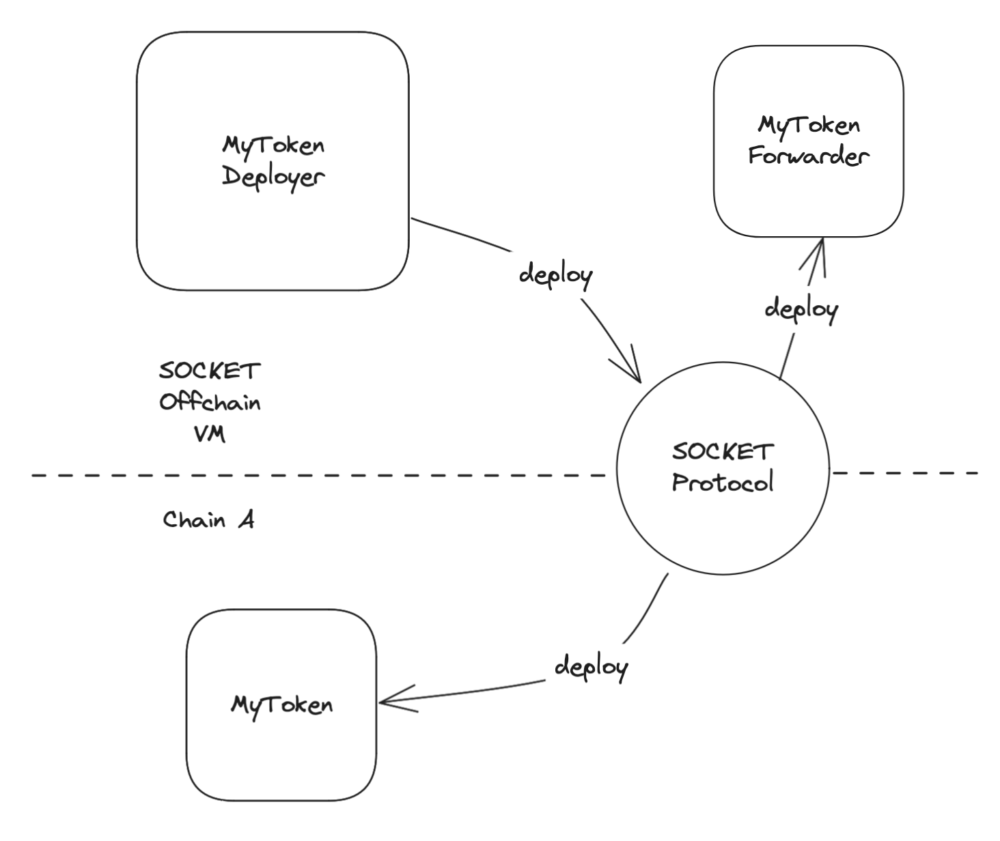
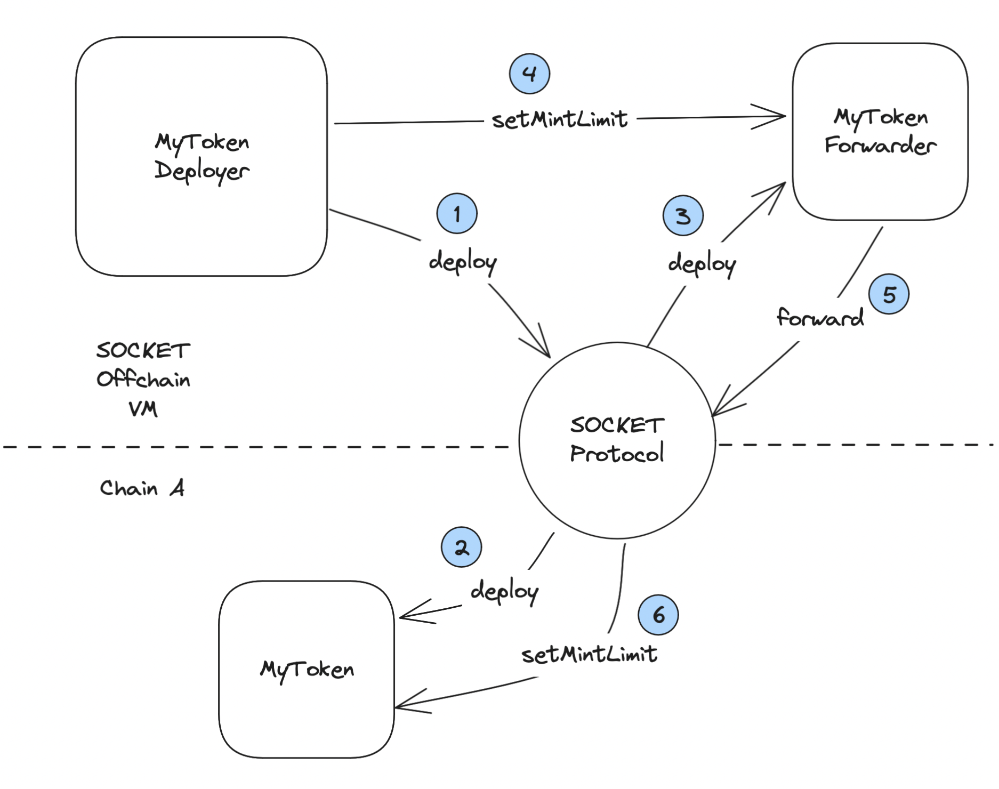

# How to deploy contracts to chains?

## 1. Deploy

Deployments of onchain contracts from Offchain VM is done using a Deployer contract. Lets look at the deployer of `MyToken` example to better understand.



```solidity
contract MyTokenDeployer is AppDeployerBase {
    bytes32 public myToken = _createContractId("myToken");

    constructor(
        address addressResolver_,
        FeesData memory feesData_,
        string calldata name_,
        string calldata symbol_,
        uint8 decimals_
    ) AppDeployerBase(addressResolver_, feesData_) {
        creationCodeWithArgs[myToken] = abi.encodePacked(
            type(MyToken).creationCode,
            abi.encode(name_, symbol_, decimals_)
        );
    }

    function deployContracts(
        uint32 chainSlug
    ) external async {
        _deploy(myToken, chainSlug);
    }

    function initialize(uint32 chainSlug) public override async {}
}
```

Key things to note here are -

It extends the `AppDeployerBase` to manage the deployment process.

To identify the contract, we use a `bytes32` variable. This is a unique identifier for the contract and is used to fetch the `creationCode`, `on-chain addresses` and `forwarder addresses` from maps in `AppGatewayBase`. This identifier can be created using `_createContractId` function.

In the `constructor`, `MyToken`'s `creationCode` with constructor parameters is stored in a mapping. This stored code is used for deploying the token to the underlying chains. The constructor also takes in `addressResolver` and `feesData`, we will talk more on these at a later stage. Or you can read more about them [here](/call-contracts).

The `deployContracts` function takes a `chainSlug` as an argument, specifying the chain where the contract should be deployed. It calls the inherited `_deploy` function and uses the `async` modifier for interacting with underlying chains. When you call \_deploy, both the onchain contract and its [forwarder](/call-contracts) are deployed.

The `initialize` function is empty in this example, lets see when that can be used next.

## 2. Initialize

Since we store the `creationCode` along with `constructor parameters`, they essentially become constants. But there can be use cases where the contract need dynamic or chain specific values while setting up. For such cases, the initialize flow has to be used. Lets extend the `MyToken` example to set mint limits.



```solidity
contract MyToken is ERC20 {
    ...

    uint256 mintLimit;

    function mint(address to_, uint256 amount_) external onlySOCKET {
        require(amount_ <= mintLimit, "more than mint limit");
        _mint(to_, amount_);
    }

    function setMintLimit(uint256 newLimit) external onlySOCKET {
        mintLimit = newLimit;
    }
}
```

We will set this limit using `initialize` function, and to make things a bit more dynamic, we will set a higher limit for Ethereum compared to chains.

```solidity
contract MyTokenDeployer is AppDeployerBase {
    ...

    function initialize(uint32 chainSlug) public override async {
        uint256 mintLimit;
        if (chainSlug == 1) {
            mintLimit = 10 ether;
        } else {
            mintLimit = 1 ether;
        }

        MyToken(forwarderAddresses[myToken][chainSlug]).setMintLimit(
            mintLimit
        );
    }
}
```

The initialize function follows similar flow to how you make on [chain calls](/call-contracts) using the `async` modifier and `forwarderAddress`.

You can also note that the forwarder addresses of deployed contracts are stored in `forwarderAddresses` mapping in the `AppDeployerBase` and can be accessed easily here.

## 3. Deploy multiple contracts

So far we have been working with a single `MyToken` contract on chain. But the deployer also supports working with multiple contracts. Lets create `MyTokenVault` to lock tokens on chain and extend the deployer to deploy both contracts.

```solidity
contract MyTokenVault {
    address public myToken;
    address public _SOCKET;

    // user => amount
    mapping(address => uint256) public lockedAmount;

    constructor() {
        _SOCKET = msg.sender;
    }

    error NotSOCKET();

    modifier onlySOCKET() {
        if (msg.sender != _SOCKET) revert NotSOCKET();
        _;
    }

    function setMyToken(address myToken_) external onlySOCKET {
        myToken = myToken_;
    }

    function lock(uint256 amount) external {
        MyToken(myToken).transferFrom(msg.sender, address(this), amount);
        lockedAmount[msg.sender] += amount;
    }

    function unlock(uint256 amount) external {
        lockedAmount[msg.sender] -= amount;
        MyToken(myToken).transfer(msg.sender, amount);
    }
}
```

This contract needs to be on chain, therefore lets change `MyTokenDeployer` to include it as well.

```solidity
contract MyTokenDeployer is AppDeployerBase {
    bytes32 public myToken = _createContractId("myToken");
    bytes32 public myTokenVault = _createContractId("myTokenVault");

    constructor(
        address addressResolver_,
        FeesData memory feesData_,
        string calldata name_,
        string calldata symbol_,
        uint8 decimals_
    ) AppDeployerBase(addressResolver_, feesData_) {
        creationCodeWithArgs[myToken] = abi.encodePacked(
            type(MyToken).creationCode,
            abi.encode(name_, symbol_, decimals_)
        );

        creationCodeWithArgs[myTokenVault] = type(MyTokenVault).creationCode;
    }

    function deployContracts(uint32 chainSlug) external async {
        _deploy(myToken, chainSlug);
        _deploy(myTokenVault, chainSlug);
    }

    function initialize(uint32 chainSlug) public override async {
        uint256 mintLimit;
        if (chainSlug == 1) {
            mintLimit = 10 ether;
        } else {
            mintLimit = 1 ether;
        }

        address myTokenForwarder = forwarderAddresses[myToken][chainSlug];
        address myTokenVaultForwarder = forwarderAddresses[myTokenVault][chainSlug];
        address myTokenOnChainAddress = getOnChainAddress(myToken, chainSlug);

        MyToken(myTokenForwarder).setMintLimit(
            mintLimit
        );
        MyTokenVault(myTokenVaultForwarder).setMyToken(
            myTokenOnChainAddress
        );
    }
}
```

This `MyTokenDeployer` deploys both contracts, sets limit on `MyToken` and sets `MyToken’`s onchain address on `MyTokenVault`. Key things to note in this contract -

- `MyTokenVault` doesn't have any constructor arguments. Therefore we can directly store its `creationCode` without encoding anything along with it.
- We can get the forwarder addresses of both these from `forwarderAddresses` mapping.
- Since `MyTokenVault` locks `MyToken`, its needs the token’s on chain address. This address can be fetched using `getOnChainAddress` function.
