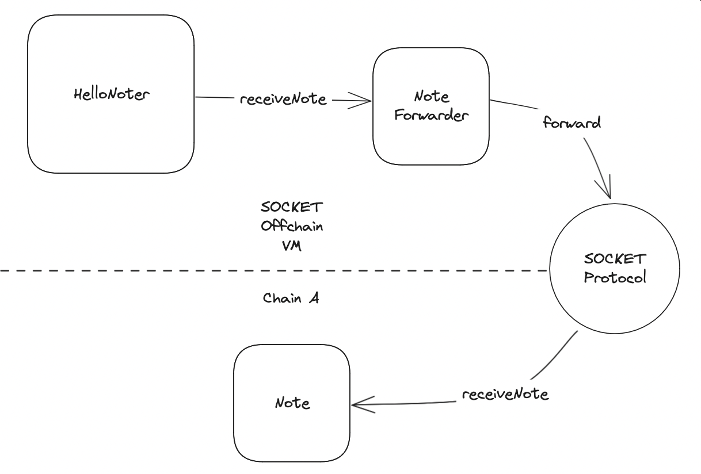

# Forwarder addresses

SOCKET works with special `forwarder` contracts that are deployed automatically when you [deploy](/deploy) your on chain contracts. Each forwarder contract is immutable and points to a specific `(chain,address)`. This is how it knows which chain and which address to forward calls to when it is called. The `AppGatewayBase` contract has utilities like `async` modifier to make it easier to work with SOCKET primitives.

Let us look at how this is executed to better understand what is going on.

<!-- TODO: Explain how to retrieve Forwarder addresses -->
