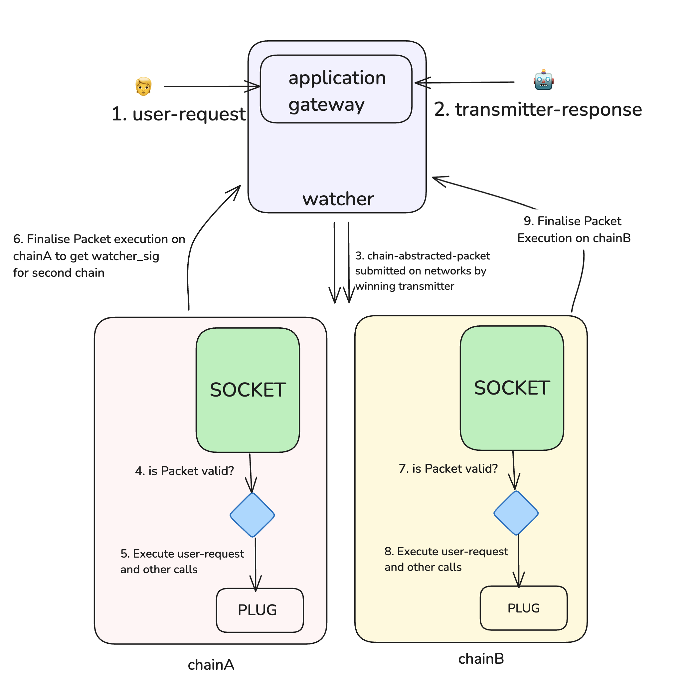

## What is Socket Protocol?

Socket Protocol is the first Chain Abstraction Protocol, offering a modular, extensible, and composable stack that enables chain-abstracted applications.

:::tip
Searching for documentation on **Socket Liquidity Layer**, **Socket API**, or **Socket Widget**? These resources are part of Bungee and can be found in the [Bungee Docs](https://docs.bungee.exchange/).
:::

### The Problem

Protocols and users face significant challenges in the current multi-chain ecosystem:

For Protocols:

- Fragmentation of user experience, liquidity, and ecosystems across multiple blockchains.
- Difficult choice between broad multi-chain presence (increasing operational overhead) or limited chain focus (potentially missing users).

For Users:

- Complex manual navigation across multiple chains.
- Overwhelming number of intermediaries and steps required for cross-chain interactions.

The effect of having unaligned intermediaries in between the target application and the user leads to fragmentation of users, assets, and liquidity and breaks the composability we use blockchains for.

### The Solution

Socket Protocol addresses these challenges with chain abstraction enabling an application-centric design. Socket protocol helps developers to create chain-abstracted packets that execute and settle on multiple chains, positioning applications as the primary touchpoint between users and blockchain networks.

## Explore Socket Protocol

Want to dive deeper into Socket Protocol? We've got you covered:

- Read our comprehensive [Whitepaper](https://media.socket.tech/SocketProtocol_v1.pdf) for an in-depth understanding of Socket Protocol.
- Ready to build? [Join our waitlist](https://forms.gle/8hgm4miEyEcaBc8x5) to become one of the first developers to build with Socket.
