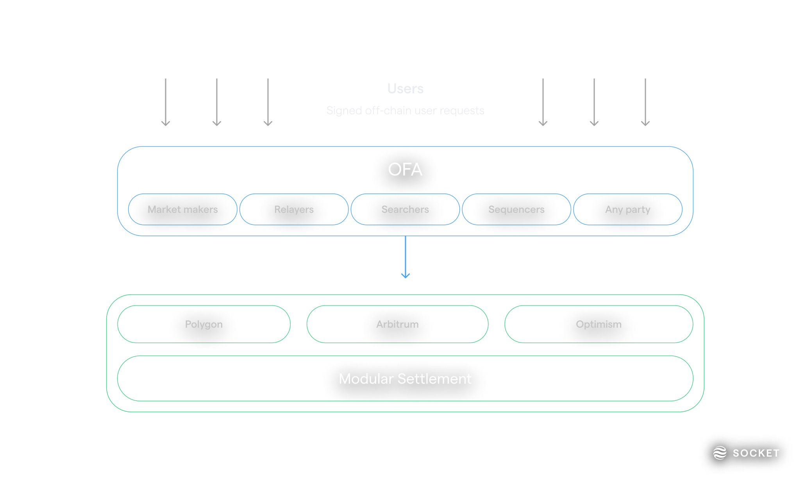

Socket 2.0 is the first chain abstraction layer for Web3. It is a modular, extensible, and composable protocol that enables chain-agnostic applications. Socket abstracts away the underlying complexity of chains, allowing users to interact with applications without having to worry about the underlying chain.

:::tip
Searching for documentation on **Socket Liquidity Layer**, **Socket API**, or **Socket Widget**? These resources are part of Bungee and can be found in the [Bungee Docs](https://docs.bungee.exchange/).
:::

## Chain Abstraction vs. Cross Chain

Socket 2.0 is focused on **Chain Abstraction** rather than **Cross Chain**. While these terms are often used interchangeably, they are not the same thing:

- **Cross Chain** protocols are designed to facilitate communication between different blockchains. They are typically used to transfer assets between chains, such as wrapped tokens or to synchronize state between chains by sending messages back and forth.

- **Chain Abstraction** is a higher-level concept that abstracts away the underlying chain, allowing developers to build applications that are chain-agnostic.

> _For example, a cross-chain protocol might allow you to transfer an asset from Optimism to Arbitrum One. Chain abstraction, on the other hand, would allow you to build an application that works on both Optimism and Arbitrum One without having to worry about the differences between the two chains._

## Modular Order Flow Auction

A key mechanism of Socket 2.0 is the Modular Order Flow Auction (MOFA). MOFA essentially creates an open marketplace for execution agents (transmitters) and off-chain user-requests (signed authorizations of user-intents), where transmitters compete to settle user requests on-chain.

This process enables users to seamlessly interact across any supported network without concern for the inherent complexities. Users will be able to interact with applications on any chain without having to worry about the underlying chain and get the best possible execution.

## More coming soon...

This is just the beginning. We are working on a lot of exciting features and improvements to Socket. Stay tuned for more updates!
