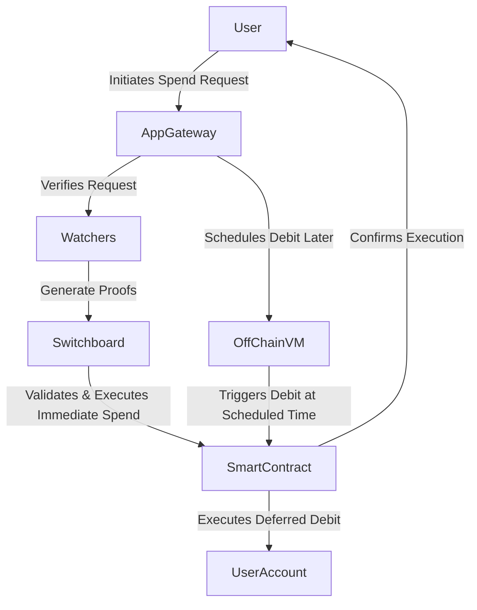

# Implementing MagicSpend on SOCKET

## Overview

"MagicSpend: Spend Now, Debit Later" allows users to spend assets immediately while deferring the debit process. SOCKET's chain-abstraction architecture is well-suited to facilitate this by combining off-chain agents and on-chain contracts.

## Architecture Overview

### Key SOCKET Components

| Component      | Description |
|---------------|-------------|
| **Watchers** | Off-chain operators monitoring blockchain activities and generating proofs for on-chain validation. |
| **Transmitters** | Assemble watcher-generated proofs and execute transactions on-chain. |
| **Switchboards** | On-chain smart contracts validating watcher proofs and executing conditional logic. |
| **App-Gateways** | Off-chain logic for managing user requests, composing transactions, and handling security pre-checks. |

## System Flow

## Implementation Steps

### Step 1: Immediate Spending Logic
- The **App-Gateway** listens for user spend requests.
- Calls the **Smart Contract** to execute the immediate transaction.
- Returns a confirmation to the user.

### Step 2: Deferred Debit Mechanism
- The **App-Gateway** schedules the debit in the **Off-Chain VM**.
- The **Watcher** monitors the scheduled time.
- When the time arrives, the **Watcher** triggers a proof for the **Switchboard**.
- The **Smart Contract** executes the debit from the user’s account.

## Key Considerations

### Security Measures
- **On-Chain State Validation**: Before allowing a spend, check balances using `read()` functions.
- **Fraud Prevention**: Implement signature verifications in **Switchboard**.
- **Failover Handling**: Define fail-safe conditions if a scheduled debit fails (e.g., fallback mechanisms, notifications).

### Handling Async Operations
- Use the `async` modifier in **App-Gateway** to manage multiple chained operations efficiently.
- Implement **callback-based promises** to synchronize transactions with user accounts.

## Conclusion
By leveraging SOCKET’s architecture, **MagicSpend** can be implemented securely and efficiently, ensuring users can spend assets immediately while managing debits asynchronously.
