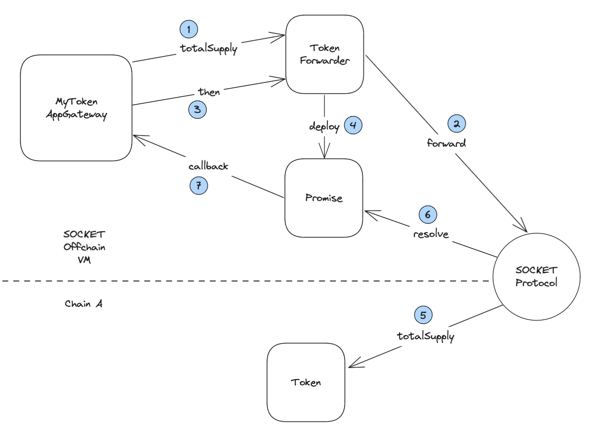

# How to read onchain state

## 1. Read Example

SOCKET supports reading public variables and functions from the underlying chains. To understand how this is done, lets extend our MyToken example that was introduced in our [guide](https://www.notion.so/Writing-Apps-on-SOCKET-e36d5b863f4a407cb5e6f7649b21a6d5?pvs=21).

On `MyTokenAppGateway`, we will create a `fetchSupply` function. This function will read the `totalSupply` of a given instance and store it on the `AppGateway`.

```solidity
interface IMyTokenReader {
    function totalSupply() external;
}

contract MyTokenAppGateway is AppGatewayBase {
    ...

    // forwarder => supply
    mapping(address => uint256) public fetchedSupply;

    function fetchSupply(address forwarder) async {
        isReadCall = true;

        IMyTokenReader(forwarder).totalSupply();

        address asyncPromise = IPromise(forwarder).then(
            this.fetchSupplyCallback.selector,
            abi.encode(forwarder) // passed to callback
        );

				isValidPromise[asyncPromise] = true;
    }

    function fetchSupplyCallback(
        bytes calldata data,
				bytes calldata returnData
    ) external onlyPromises {
        uint256 forwarder = abi.decode(data, (address));
        uint256 supply = abi.decode(returnData, (uint256));
        fetchedSupply[forwarder] = supply;
    }
}
```

Notice following things in above contract -

- `fetchSupply` function uses the `async` modifier. This modifier needs to be used for both write and read calls to underlying chains.
- `isReadCall` flag is set to `true`. This flag indicates to SOCKET that the call doesnt need to be sent on chain and just the return data needs to be read.
- The `totalSupply` call uses `IMyTokenReader` interface. The `totalSupply` function signature is similar to a standard token contract but its visibility is not restricted to `view` and it doesnt have a return value. This needs to be followed for all read calls. The interface needs to be changed in this way to be compatible with the `async` `forwarder` system on Offchain VM.
- Also, unlike a read on single chain, the return data here is not returned synchronously. Instead it has to be read asynchronously via a `promise` and a `callback` function.
  The `forwarder` address is interfaced as `IPromise` and `then` function is called on it. In this function we pass the callback function signature as first parameter and data for callback as second parameter.
- `asyncPromise` address is returned by `then` function call and it is marked in `isValidPromise` mapping. This is done to validate callers of the callback.
- `fetchSupplyCallback` uses `onlyPromises` modifier and has 2 params. First param is the `data` passed from original function and second param is the `returnData` from chain.

## 2. Promises

Let us look at how this is executed to better understand what is going on.



To support asynchronous composability, SOCKET works with special `promise` contracts that are deployed when you call `then` function. Each promise contract is immutable and specific to a read request. It can be used only once and holds context about what needs to be called on callback. The `AppGatewayBase` contract has utilities like `isReadCall`, `isValidPromise`, `onlyPromises` to make it easier to work with SOCKET primitives.
