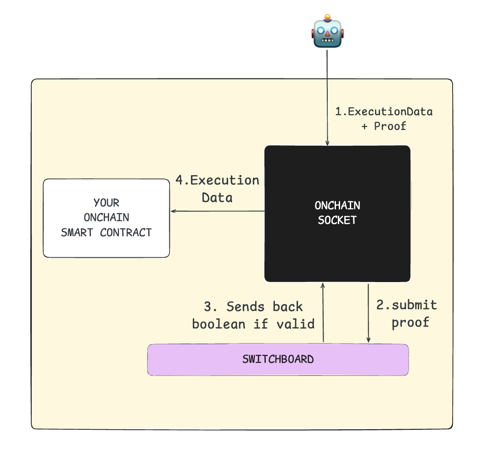

**Switchboards** are on-chain verifiers that coordinate with **Watchers**. They play a crucial role in validating off-chain proofs and ensuring the integrity of application interactions. Here's what makes Switchboards unique:

### Key Features of Switchboards

- **Permissionless Registration:**
  Anyone can create and register a Switchboard with **SOCKET**, making the system open and decentralized.

- **Lightweight Interface:**
  The interface is designed to be simple and efficient. Switchboards accept proofs and return a boolean response indicating whether the proof is accepted (`true`) or rejected (`false`).

- **Application-Defined:**
  Application developers have the freedom to choose any Switchboard that fits their specific security, cost, and latency requirements.

- **Proof-Agnostic:**
  Switchboards are flexible in the type of proofs they accept — from oracle attestations and zk-proofs to optimistic submissions and multi-signature attestations.

Think of **Switchboards** as the connective tissue between **Watchers** and application developers. They empower developers to coordinate effectively with off-chain operators by providing a standardized way to verify proofs before interacting with on-chain smart contracts.

### How Switchboards Work

Switchboards are **smart contracts** that accept various types of proofs, such as zk-proofs or multi-signature proofs. They process these proofs and return a boolean (`true/false`) based on the conditions defined by the developer. These on-chain conditions are executed **before** the application's smart contract is called, allowing developers to enforce any necessary pre-validation logic.

Switchboards ensure that off-chain actions are properly verified, creating a seamless bridge between off-chain operators and on-chain application logic.
