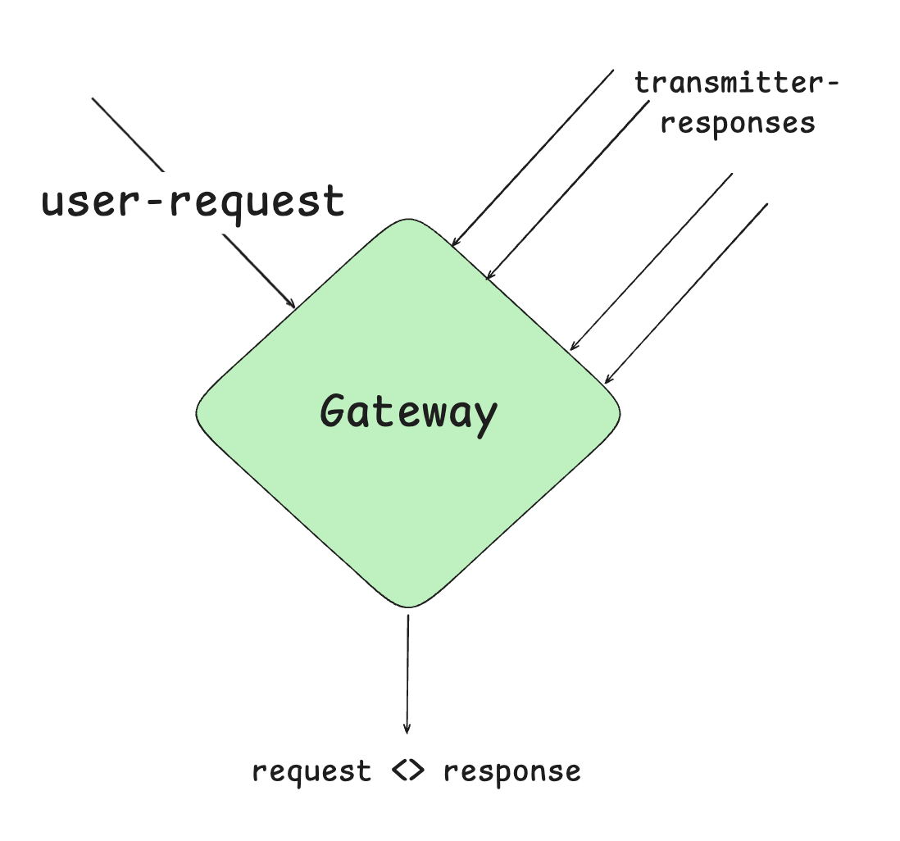

**Transmitters** are off-chain smart agents that monitor user requests and submit responses. The **App-Gateway** evaluates these responses based on the predefined logic within it, selecting the most suitable response. The chosen response earns the right to execute the request on-chain.

Depending on the type of application, Transmitters are often referred to by various names, including **Relayers**, **Solvers**, **Fillers**, **Provers**, or **Paymasters**.

> **Transmitter** is a general term used to describe a group of smart off-chain agents that respond to user requests with appropriate responses.

Transmitters play a crucial role in ensuring efficient off-chain execution while maintaining the integrity of on-chain interactions. They provide flexibility for applications to optimize request handling, improving performance, security, and user experience.
