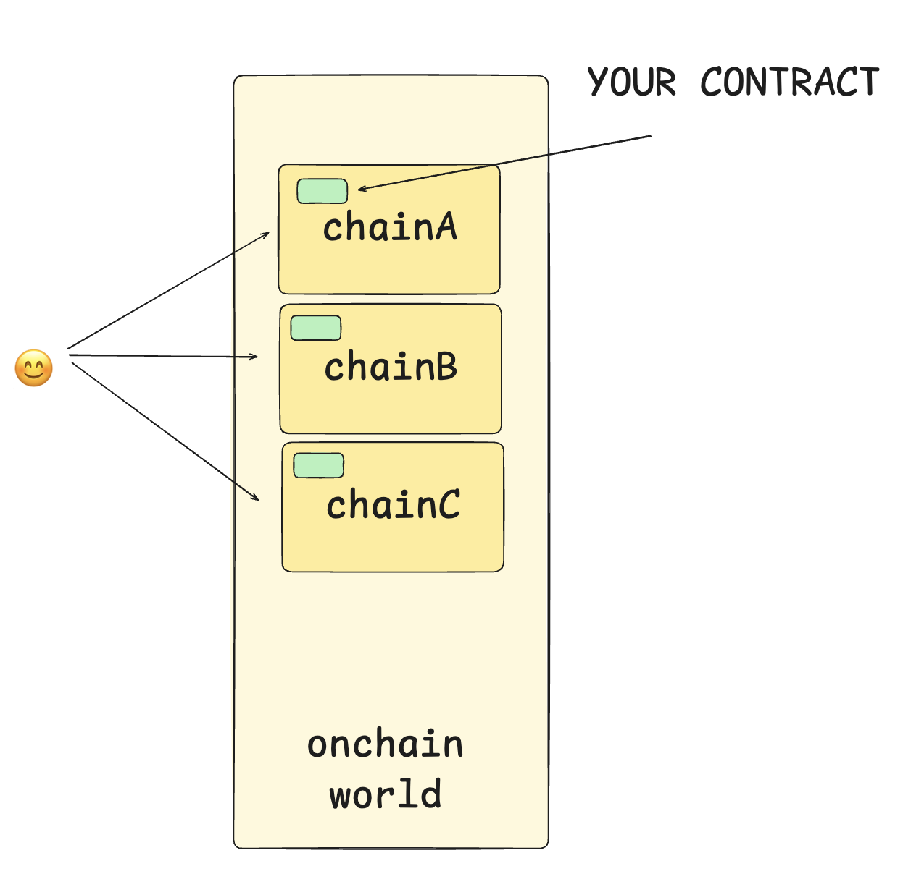
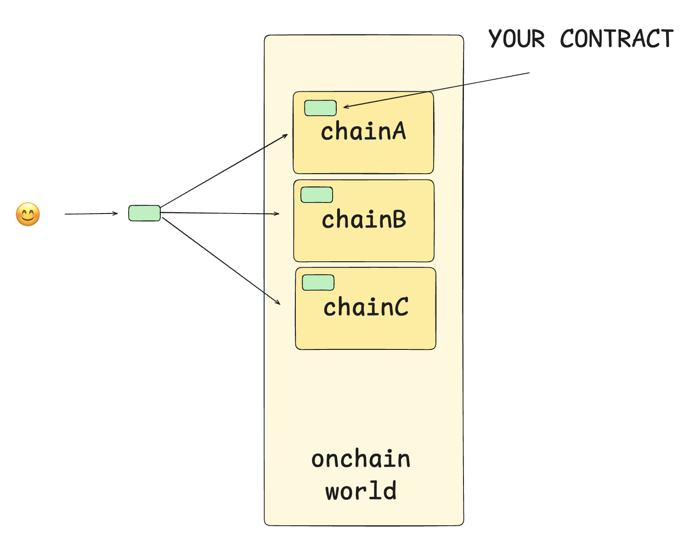

# Watchers

If you have read the broad architecture, first do that by reading [this section](/architecture).

## Introduction

> Watchers are offchain operators that sit and watch chains while also hosting a VM to help application developers write logic there, logic that sits and operates globally, logic that is executed before your applications onchain contracts are executed.

Today when users try to use your application, they need to access the application via the chain, more chains, more gas, more bridging and all the known issues. Going forward, applications or rather app-devs can help users execute their actions better onchain.

Watchers are extremely flexible, they sit between the user and the onchain world, allowing application developers to insert useful logic in between that pathway to help users interact with your application better. We call this application defined offchain logic as “app-gateway” that users first interact with before execution of onchain contracts. App-Gateway can enable chain-abstraction by acting as glue for their onchain contracts, [Vitalik mentions of similiar ideas in his blog here on how Modern Applications evolve.](https://vitalik.eth.limo/general/2024/09/02/gluecp.html) Developers and build and deploy app-gateway’s on the watcher-services.

## Relationship between Watchers and Switchboards

If watchers are offchain operators then switchboards are their counterpart, switchboards help application developers select and work with watchers. Anyone can be a watcher and anyone can create a switchboard for their watcher, allow app-developers to have full control and ability to customise. Read more about switchboards here

:::info
Watchers are offchain proof creators, switchboards onchain are proof-consumers.
:::
