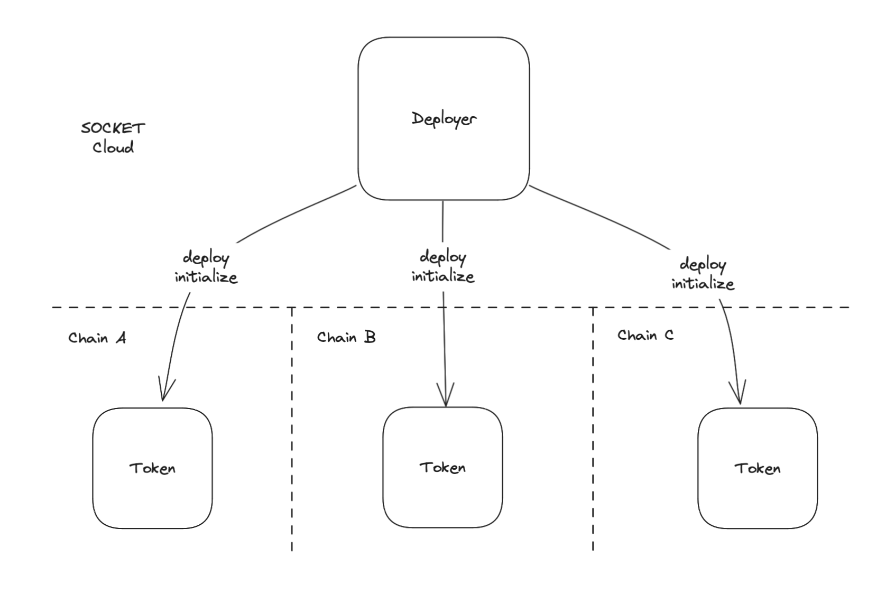
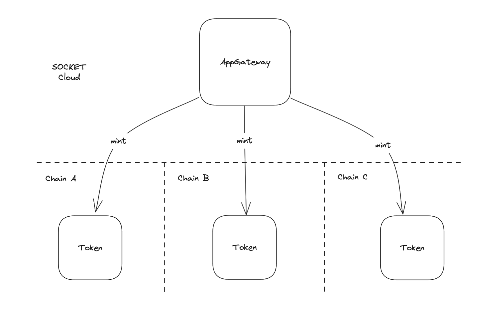

# Writing Apps on SOCKET

# 1. Introduction

In this guide, we’ll build a **Airdrop application** using the Socket Protocol. Make sure your environment is set up with [socket-starter-kit](/getting-started) before proceeding.

You’ll learn how to:

- Create a multi-chain mintable and burnable token contract.
- Build an airdrop mechanism.
- Use offchainVM to check eligibility and trigger on-chain minting.
- Deploy and test your app across multiple chains.

# 2. Architecture Overview

The System consists of 3 main components.

- An on chain **ERC20 Token Contract** that can be deployed to any chain.
- A **Deployer Contract** on offchainVM to deploy the **ERC20 Token** instances.
- An **AppGateway Contract** on offchainVM that verifies users and triggers minting of tokens on desired instance.

### **Deployment Flow**



### Mint flow



# 3. Step-by-Step Implementation

To begin, we’ll implement a token contract for our application. The token will be an ERC20 token with mint and burn capabilities, specifically designed to interact with the Socket Protocol. We'll use **Solmate**, a lightweight library for ERC20 implementation.

### Install Solmate

Install Solmate as a dependency using Forge:

```bash
forge install transmissions11/solmate
```

### Token Contract Implementation: MyToken.sol

Here’s the implementation of the `MyToken` contract that uses Solmate's ERC20 as a base. Apart from the standard ERC20 functionality, it has functions to mint and burn tokens from the `AppGateway`.

```solidity
// SPDX-License-Identifier: GPL-3.0
pragma solidity >=0.7.0 <0.9.0;

import "solmate/tokens/ERC20.sol";

contract MyToken is ERC20 {
    address public _SOCKET;

    constructor(
        string calldata name_,
        string calldata symbol_,
        uint8 decimals_
    ) ERC20(name_, symbol_, decimals_) {
        _SOCKET = msg.sender;
    }

    error NotSOCKET();

    modifier onlySOCKET() {
        if (msg.sender != _SOCKET) revert NotSOCKET();
        _;
    }

    function mint(address to_, uint256 amount_) external onlySOCKET {
        _mint(to_, amount_);
    }

    function burn(uint256 amount_) external onlySOCKET {
        _burn(msg.sender, amount_);
    }
}
```

This contract is expected to be deployed via SOCKET, therefore `_SOCKET` address is set as the `msg.sender` in the constructor.

The `mint` and `burn` functions have `onlySOCKET` modifier because these are called by `AppGateway` via SOCKET.

### Deployer Contract Implementation: MyTokenDeployer.sol

Here’s the implementation of `MyTokenDeployer` contract which will be deployed to offchainVM. It extends the `AppDeployerBase` to manage the deployment process.

```solidity
pragma solidity >=0.7.0 <0.9.0;

import "./MyToken.sol";
import "socket-poc/contracts/base/AppDeployerBase.sol";

contract MyTokenDeployer is AppDeployerBase {
    address public myToken;

    constructor(
        address addressResolver_,
        FeesData memory feesData_,
        string calldata name_,
        string calldata symbol_,
        uint8 decimals_
    ) AppDeployerBase(addressResolver_, feesData_) {
        myToken = address(new MyToken(name_, symbol_, decimals_));
        creationCodeWithArgs[myToken] = abi.encodePacked(
            type(MyToken).creationCode,
            abi.encode(name_, symbol_, decimals_)
        );
    }

    function deployContracts(
        uint32 chainSlug
    ) external async {
        _deploy(myToken, chainSlug);
    }

    function initialize(uint32 chainSlug) public override async {}
}
```

In the `constructor`, a copy of `MyToken` is deployed to the offchainVM, and its `creationCode` along with constructor parameters is stored in a mapping. This stored code is used for deploying the token to the underlying chains. While this example handles a single contract, you can extend it to manage multiple contracts by storing their creation codes. The constructor also takes in `addressResolver` and `feesData`, we will talk more on these at a later stage. Or you can read more about them [here](/call-contracts).

The `deployContracts` function takes a `chainSlug` as an argument, specifying the chain where the contract should be deployed. It calls the inherited `_deploy` function and uses the `async` modifier for interacting with underlying chains.

The `initialize` function is empty in this example. Use it for setting chain-specific or dynamic variables after deployment if needed. More details [here](/deploy).

### AppGateway Contract implementation: MyTokenDistributor.sol

`MyTokenDistributor` is an AppGateway, it extends `AppGatewayBase` for logic related to interacting with onchain instances. This is where users interact with your app without worrying about the underlying chains. It has an `addAirdropReceivers` function that the owner can call and a `claimAirdrop` function that users can call.

```solidity
// SPDX-License-Identifier: GPL-3.0
pragma solidity >=0.7.0 <0.9.0;

import "socket-poc/contracts/base/AppGatewayBase.sol";
import "solmate/src/auth/Owned.sol";
import "./MyToken.sol";

contract MyTokenDistributor is AppGatewayBase {
    mapping(address => uint256) public airdropReceivers;

    constructor(
        address _addressResolver,
        address deployerContract_,
        FeesData memory feesData_
    ) AppGatewayBase(_addressResolver, feesData_) Owned(msg.sender) {
        addressResolver.setContractsToGateways(deployerContract_);
    }

    function addAirdropReceivers(
        address[] calldata receivers_,
        uint256[] calldata amounts_
    ) external onlyOwner {
        for (uint256 i = 0; i < receivers_.length; i++) {
            airdropReceivers[receivers_[i]] = amounts_[i];
        }
    }

    function claimAirdrop(address _instance) external async {
        uint256 amount = airdropReceivers[msg.sender];
        airdropReceivers[msg.sender] = 0;
        MyToken(_instance).mint(msg.sender, amount);
    }
}
```

In constructor we set the `deployerContract` as a contract that belongs to this Gateway. This is how you indicate which contracts are allowed to call your onchain contracts and SOCKET protocol knows where to charge fees from when a contract on offchainVM calls a contract on chain.

The `claimAirdrop` function again has an async modifier, similar to `deployContracts` and `initialize` function of the deployer. This modifier should be used whenever read or write calls are made to the underlying contracts. You can read more about [writes](/call-contracts) and [reads](/read).

# 4. Deployment and Fee setup

With the contracts ready, we can go on to deploy things. In true Chain Abstracted spirit, you as a developer only need to interact with the offchainVM and never with the chains directly unless you want to verify if things were done correctly.

### Deploy Contracts to offchainVM: SetupMyToken.s.sol

You need to deploy the `MyTokenDeployer` and `MyTokenDistrbutor` to the offchainVM.

You can get the `addressResolver` from [here](/chain-information).

```solidity
// SPDX-License-Identifier: UNLICENSED
pragma solidity ^0.8.13;

import {Script, console} from "forge-std/Script.sol";
import {MyTokenDeployer} from "../src/MyTokenDeployer.sol";
import {MyTokenDistributor} from "../src/MyTokenDistributor.sol";

contract SetupMyToken is Script {
    function setUp() public {}

    function run() public {
        vm.startBroadcast();

        MyTokenDeployer myTokenDeployer = new MyTokenDeployer(
            addressResolver,
            feesData, // move to setter
            "MyToken",
            "MTK",
            18
        );

        MyTokenDistributor myTokenDistributor = new MyTokenDistributor(
            addressResolver,
            address(myTokenDeployer), // move to setter
            feesData
        );

        console.log(
            "MyTokenDeployer deployed at: ",
            address(myTokenDeployer)
        );
        console.log(
            "MyTokenDistributor deployed at: ",
            address(myTokenDistributor)
        );

        vm.stopBroadcast();
    }
}
```

Run the script using cast, providing rpc and private key.

```bash
forge script ./script/SetupMyToken.s.sol --rpc-url <RPC_URL> --private-key <PRIVATE_KEY>
```

### Fund your App

Next, go on to setup fees so that offchainVM can send transactions and deploy contracts on your app’s behalf. On any supported chain, deposit fees against `MyTokenDistributor`’s address. Read more about setting up fees and generating `feesData` [here](https://www.notion.so/Fees-yeah-14d818fd2858801daec8fc60fa4631b5?pvs=21).

### Deploy Token to chains: DeployMyToken.s.sol

Once your app is funded, you can trigger the deployment of `MyToken` on desired chains. In this case as well, just interact with offchainVM. Call `deployContracts` function of `MyTokenDeployer` contract for each chain where deployment needs to be done.

```solidity
// SPDX-License-Identifier: UNLICENSED
pragma solidity ^0.8.13;

import {Script, console} from "forge-std/Script.sol";
import {MyTokenDeployer} from "../src/MyTokenDeployer.sol";

contract DeployMyToken is Script {
    function setUp() public {}

    function run() public {
        vm.startBroadcast();

        MyTokenDeployer myTokenDeployer = MyTokenDeployer(<deployerAddress>);
        myTokenDeployer.deployContracts(<chainSlug1>);
        myTokenDeployer.deployContracts(<chainSlug2>);
        myTokenDeployer.deployContracts(<chainSlug3>);

        vm.stopBroadcast();
    }
}
```

Set proper values for `deployerAddress` and `chainSlugs` before running this script.

`deployerAddress` should have been logged in by previous script.

```bash
forge script ./script/DeployMyToken.s.sol --rpc-url <RPC_URL> --private-key <PRIVATE_KEY>
```

Deployment of on chain contracts should take couple minutes. You can track the status of this request and also check the deployed addresses using our [apis](/api).

# 5. Testing

### Add Airdrop Receivers: AddReceivers.s.sol

Once the setup is done, you can call `addAirdropReceivers`.

```solidity
// SPDX-License-Identifier: UNLICENSED
pragma solidity ^0.8.13;

import {Script, console} from "forge-std/Script.sol";
import {MyTokenDistributor} from "../src/MyTokenDistributor.sol";

contract AddReceivers is Script {
    address[] receivers = [
        <receiver1>,
        <receiver2>,
        <receiver3>
    ];
    uint256[] amounts = [
        <amount1>,
        <amount2>,
        <amount3>
    ];

    function setUp() public {}

    function run() public {
        vm.startBroadcast();

        MyTokenDistributor myTokenDistributor = MyTokenDistributor(<myTokenDistributorAddress>);
        myTokenDistributor.addAirdropReceivers(receivers, amounts);

        vm.stopBroadcast();
    }
}
```

### Claim Airdrop: ClaimAirdrop.s.sol

For each receiver that was added in previous step, they can call claimAirdrop with their desired instance address to mint tokens on the desired chain. Use our [apis](/api) to get instance addresses.

Note that the instance addresses are not the same as where token contracts are deployed on chain. The instance here is a forwarder address, read more about it [here](/call-contracts).

```solidity
// SPDX-License-Identifier: UNLICENSED
pragma solidity ^0.8.13;

import {Script, console} from "forge-std/Script.sol";
import {MyTokenDistributor} from "../src/MyTokenDistributor.sol";

contract ClaimAirdrop is Script {
    function setUp() public {}

    function run() public {
        vm.startBroadcast();

        MyTokenDistributor myTokenDistributor = MyTokenDistributor(<myTokenDistributorAddress>);
        myTokenDistributor.claimAirdrop(<instance>);

        vm.stopBroadcast();
    }
}
```
