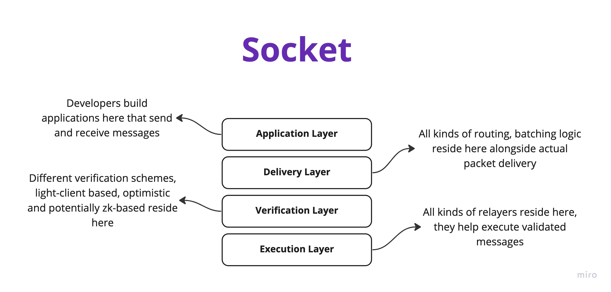
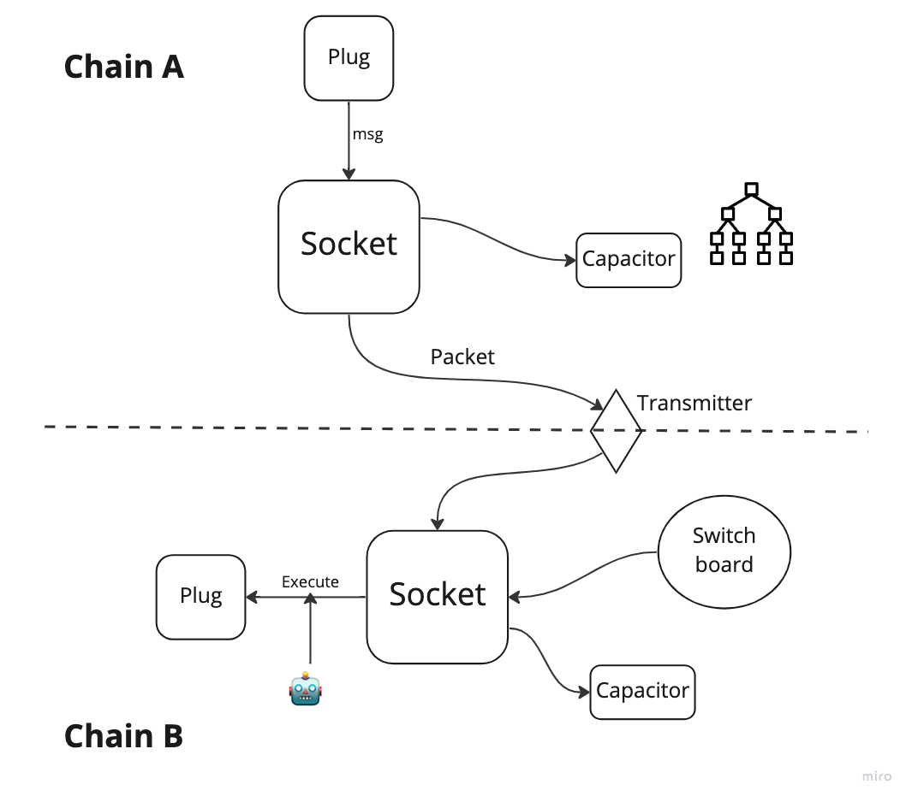
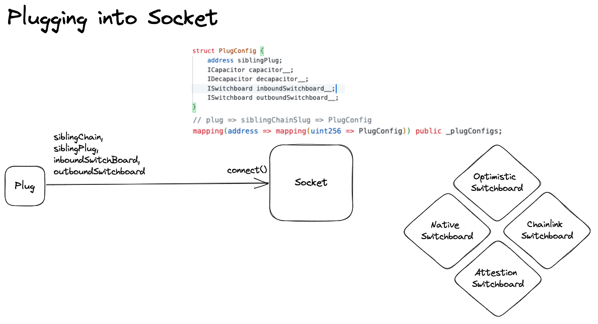

# Basics 


# Design

SocketDL’s design philosophy is inspired by the cosmos stack, we have broken down interoperability into different layers that can individually innovate or mutate based on context and be the most effective at all times.

 

Modularity provides us the following benefits:

- **Future Proof**: Parts of codebase can be updated as innovation happens: We can remain future proof
- **Faster Innovation**: Since roles, responsibilities and interfaces for each layer are clearly defined, each layer can optimise and grow individually and freely. Leading to better overall interop stack
- **More Secure:** Builds up lindy effect for the codebase ie if a new batching method becomes widely adopted, we can switch to it with only 100 lines of code diff. Rest of the codebase remains same, reducing potential for smart contract related hacks.
- **Context based messaging:** Layers can be configured to function differently based on context i.e use rollup native bridges, light-clients as the verification method where-ever available.

More-over we allow applications to customise security for them



# Layers and Usage

- **Application Layer**: Plugs reside on this layer, applications have a clear API that they can use to connect, transmit and receive messages. As well as clear APIs on what the message and packet identifiers are for on-chain tracking of progress.  No matter how the rest of the stack is structured these interfaces are not supposed to change, you write your application once for an execution environment i.e EVM and you use it everywhere
    - Connect to Socket
    
    ```solidity
    function connect(
            uint256 siblingChainSlug_,
            address siblingPlug_,
            address inboundSwitchboard_,
            address outboundSwitchboard_
    ){}
    ```
    
    - Transmit Message
    
    ```solidity
    /**
     * @notice registers a message
     * @dev Packs the message and includes it in a packet with capacitor
     * @param remoteChainSlug_ the remote chain slug
     * @param msgGasLimit_ the gas limit needed to execute the payload on remote
     * @param payload_ the data which is needed by plug at inbound call on remote
     */
    function outbound(
        uint256 remoteChainSlug_,
        uint256 msgGasLimit_,
        bytes calldata payload_
    ) external {}
    ```
    
    - Receive Messages from Socket
    
    ```solidity
    /**
     * @notice executes the message received from source chain
     * @dev this should be only executable by socket
     * @param srcChainSlug_ chain slug of source
     * @param payload_ the data which is needed by plug at inbound call on remote
     */
    function inbound(
        uint256 srcChainSlug_,
        bytes calldata payload_
    ) external payable {}
    ```
    
- **Delivery Layer**: This layer is responsible for message batching(packet formation) and packet delivery via Capacitors and Transmitters respectively.
    - Capacitors and Transmitters reside on this layer, they are responsible for creating packets from messages and delivering the packets to destination chains.
    - Capacitors are used to hold messages and create packets when its time to transmit. On the destination, post verification, once needs to release a message from the capacitor by providing a proof before the message can be executed.
    - Transmitters are offchain agents managed by TransmitterManager, they are responsible for sealing packets on the source chain and delivering them on the destination chain. They control the batching level and parameter i.e time based batching or number_of_message based batching.
- **Verification Layer**: This layer is responsible for verification of packets and messages via SwitchBoards.
    - All Socket needs from Switchboard are the following function definitions
        
        ```solidity
        interface ISwitchboard {
            function allowPacket(
                bytes32 root,
                uint256 packetId,
                uint256 srcChainSlug,
                uint256 proposeTime
            ) external view returns (bool);
        
            function payFees(
                uint256 msgGasLimit,
                uint256 dstChainSlug
            ) external payable;
        } 
        ```
        
    - Switchboard can be designed to do literally anything, switchboards have to be registered at Socket before they can be used by Plugs. Switchboard can define various conditions to accept/reject a packet, for eg: Accept packets after a timeout of 2hrs, accept packets if rollup-native bridge confirms it etc.
- **Execution Layer**: This layer is responsible for execution of messages post verification, third party relayers, hobbyists or you yourself can execute your messages.

# Contract Architecture



## Contracts and their purposes

- **Socket**: Main contract on all chains that applications connect to and build on. Packets travel from Socket on source-chain to Socket on destination-chain
- **Plugs**: Applications that connect to the socket and build on top of Socket
- **Switchboard**: Plugs connect to Socket via a Switchboard. Post the initial connection, Plugs talk to Socket directly. Switchboard provides Socket context around how and when messages are to be validated and executed.
- **TransmitterManager**: Seals capacitors on the source chain and proposes new packets on the destination socket.
- **Capacitor**: Capacitor are responsible for holding messages before they are batched together. Capacitors emit a packet once sealed.

## Actors and their roles

- **Transmitters:** Transmitters are required to Seal packets on the source chain and deliver these packets to the destination chain. Once enough messages are collected in the capacitor or enough time has passed, these transmitters call the seal function that creates a packet and now this packet is ready to be sent across chains.
- **Executors:** Once a packet is validated, anyone can become an executor and execute the messages batched under this packet.
- **Watchers:** Watchers operate switchboard, watchers primary function is to make sure the transmitters are delivering messages properly. Watchers run off-chain monitoring software to make sure the system is healthy. Watchers are employed by switchboards to validate the packets.

## Message Flow



